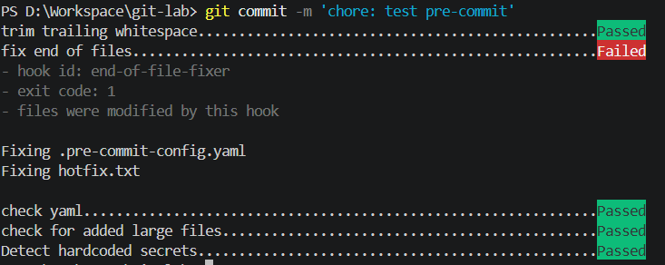
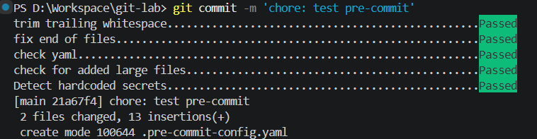

# Task Submission Template

## Task: `Day 3: Git Advanced`

* **Intern**: `Đỗ Trung Đức`
* **Phase / Week / Day**: `Phase 1 / Week 1 / Day 3`
* **Branch**: `nhiều branch trong repo demo riêng git-lab`
* **Submitted at**: `2026-06-19 23:59 (+07)`
* **Time spent**: `4 hours`

---

# 1. Mục tiêu

* Hiểu mô hình Git object model: `blob`, `tree`, `commit`, `ref`.
* Thành thạo `rebase -i`, `cherry-pick`, resolve conflict, `reflog`, `stash`, `bisect`.
* Biết 2 workflow phổ biến: trunk-based và GitFlow.
* Thiết lập hook cơ bản với `pre-commit`.

---

# 2. Cách chạy & Kết quả
## Part A (Rebase, Cherry-pick, Conflict & Squash)
Xem kết quả tại [history.md](./history.md).

---

## Part B (Tìm lại commit bị mất)
Xem hướng dẫn và kết quả tại [reflog-lab.md](./reflog-lab.md).

---

## Part C (Dò lỗi tự động - git bisect)
Xem toàn bộ log kết quả xác định commit lỗi tại [bisect.log](./bisect.log).

---

## Part D (Pre-commit Hook)

---

## Part E (So sánh Workflow)
Xem bảng đối chiếu chi tiết ưu/nhược điểm các mô hình tại [workflow-comparison.md](./workflow-comparison.md).

# 3. Kết quả

* Hoàn thành đầy đủ các phần của bài lab Git Advanced.
* Repo `git-lab` đã được push public và có đủ branch, history, log, hook, bisect, reflog.
* Các file tổng hợp được lưu trong thư mục `day-3-git/`.

---

# 4. Khó khăn & cách giải quyết

* Trong quá trình thực hành `rebase -i`, ban đầu gặp khó khăn khi conflict xảy ra ở nhiều commit liên tiếp. Cách giải quyết là đọc kỹ từng conflict marker, hiểu trạng thái từng commit trong rebase và resolve từng bước thay vì xử lý tất cả cùng lúc.

* Khi làm việc với lịch sử commit, việc đọc `git log --graph --oneline --all` khá rối do nhiều branch phân nhánh. Sau đó cải thiện bằng cách sử dụng thêm `--decorate` và theo dõi từng branch riêng để dễ hình dung luồng commit.

* Sử dụng `git reflog` giúp hiểu rằng Git vẫn lưu lại toàn bộ lịch sử di chuyển HEAD, từ đó có thể khôi phục commit đã bị mất do `reset --hard`. Điều này giúp tránh phụ thuộc hoàn toàn vào branch hiện tại khi xảy ra lỗi.

* Khi thiết lập `pre-commit`, gặp lỗi do môi trường Python/PATH khiến lệnh không nhận diện. Giải pháp là chạy trực tiếp bằng `python -m pre_commit install` để bỏ phụ thuộc vào PATH hệ thống.

* Với `git bisect`, ban đầu hơi khó theo dõi vì phải test từng commit thủ công. Sau khi hiểu quy trình binary search của Git, việc khoanh vùng commit lỗi trở nên nhanh và có hệ thống hơn.

---

# 5. Reference

* Repo thực hành: https://github.com/trungduc512/git-lab/
* Pro Git book: https://git-scm.com/book/en/v2
* Learn Git Branching: https://learngitbranching.js.org/

---

# 6. Self-check

* [x] Repo `git-lab` có đủ branch và lịch sử theo yêu cầu.
* [x] Conflict được resolve thủ công, không dùng `ours/theirs` để bỏ qua bài.
* [x] `git bisect` xác định đúng commit lỗi.
* [x] `pre-commit` block được commit có lỗi whitespace.
* [x] `workflow-comparison.md` được viết bằng lời của mình.
