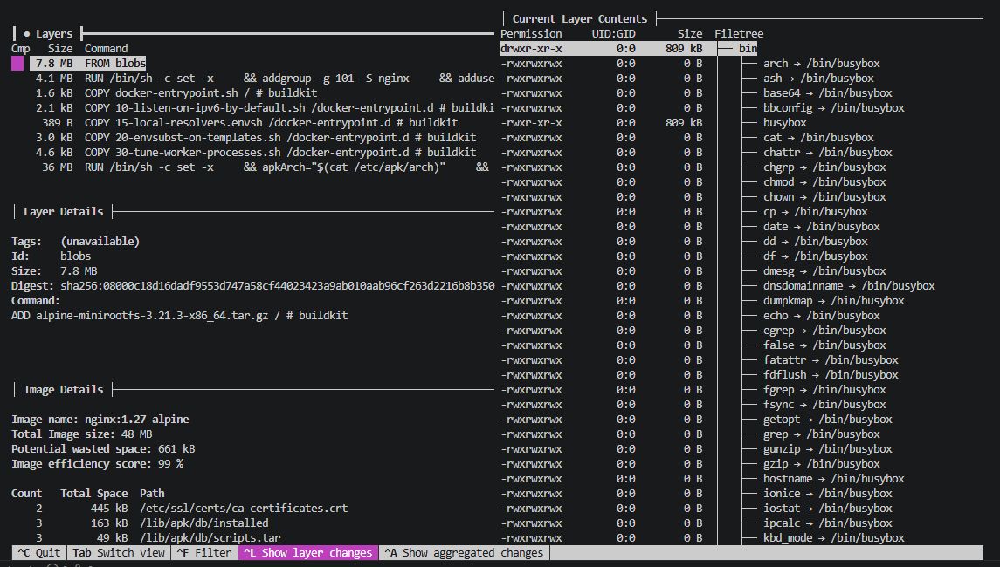
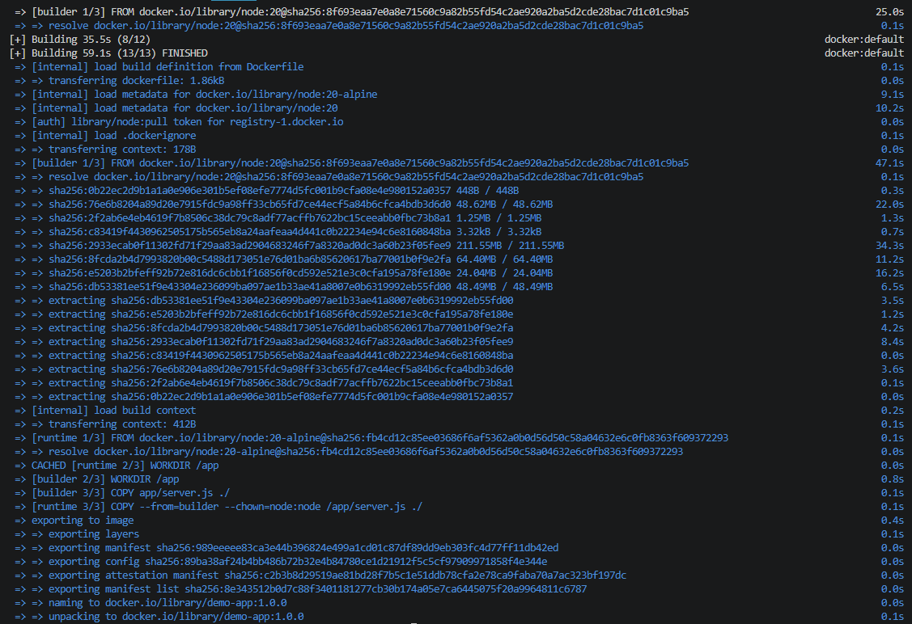
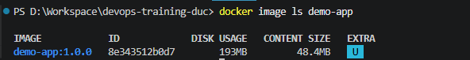
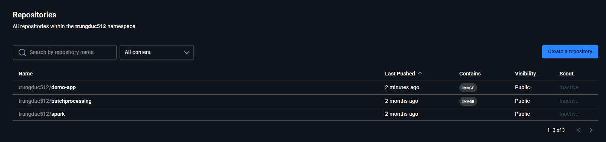
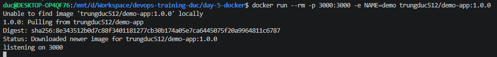
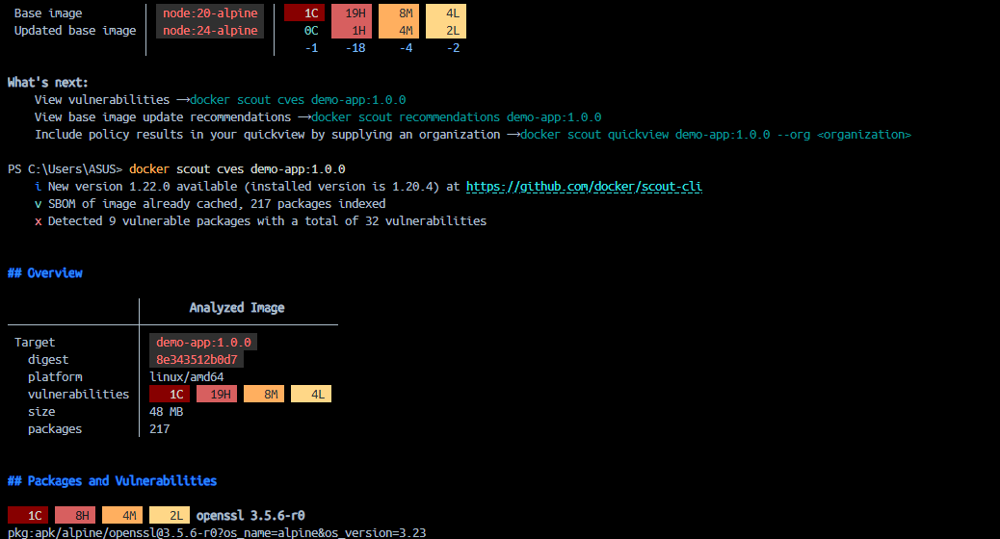

# Task: Docker Essentials

* **Intern**: Đỗ Trung Đức
* **Phase/Week/Day**: phase-1/week-1/day-5-docker
* **Branch**: phase-1/week-1/day-5-docker
* **Submitted at**: 2026-06-23
* **Time spent**: 4h

# 1. Mục tiêu

Tìm hiểu các khái niệm cơ bản của Docker và thực hành xây dựng, chạy, kết nối và phân phối container. Thực hành Docker Network, Docker Volume, Bind Mount, đẩy image lên Docker Hub và quét lỗ hổng bảo mật của image bằng Docker Scout/Trivy.

---

# 2. Cách chạy và kết quả chi tiết

Chi tiết từng phần được trình bày trong các tài liệu tương ứng.

## Part A — Image Internals

Tìm hiểu các khái niệm cơ bản:

* Docker Image Layers.
* Docker Build Cache.
* Phân biệt `COPY` và `ADD`.
* Phân biệt `CMD` và `ENTRYPOINT`.
* Vai trò của `.dockerignore`.
* `EXPOSE`.
* Chạy container với non-root user.
* Multi-stage Build.
* Healthcheck và OCI Labels.

- Xem chi tiết tại: [notes.md](notes.md)

Xem các layer của image `nginx:1.27-alpine`




---

## Part B — Dockerize Web App

Đóng gói ứng dụng Node.js thành Docker Image với các tiêu chí:

* Multi-stage build.
* Runtime sử dụng image Alpine.
* Chạy dưới quyền non-root (`USER node`).
* Thêm `HEALTHCHECK`.
* Thêm OCI Labels.
* Kích thước image được tối ưu.

Chi tiết:

* `Dockerfile`
* `.dockerignore`

Kết quả:

- build:

  

- size:

  

---

## Part C — Network & Volume

Thực hiện các bài thực hành về Docker Networking và Storage:

* Tạo bridge network `demo-net`.
* Chạy hai container `app1` và `app2` trong cùng network.
* Từ `app1` thực hiện:

```bash
curl http://app2:3000
```

và nhận được phản hồi thành công thông qua Docker DNS.

* Tạo named volume `pgdata`.
* Chạy PostgreSQL với volume `pgdata`.
* Tạo database và xác nhận dữ liệu vẫn còn sau khi restart container.
* Demo Bind Mount với Nginx:

  * Mount thư mục `site/` từ host.
  * Chỉnh sửa `index.html`.
  * Reload trình duyệt và quan sát nội dung thay đổi ngay mà không cần build lại image.

- Xem chi tiết tại: [network-volume.md](network-volume.md)

---

## Part D — Push Image

Đăng nhập Docker Hub.
Push image lên Docker Hub.



Kiểm tra bằng cách:

* Pull lại image từ Docker Hub.
* Chạy container từ image vừa pull.
* Xác nhận ứng dụng hoạt động bình thường.




---

## Part E — Scan Image

Thực hiện quét bảo mật image bằng Docker Scout hoặc Trivy.

Kiểm tra:

* Các CVE được phát hiện.
* Mức độ nghiêm trọng (Critical / High / Medium / Low).
* Lưu report phục vụ kiểm tra.



---

# 3. Reference

- [Docker overview](https://docs.docker.com/get-started/overview/)
- [Best practices for writing Dockerfiles](https://docs.docker.com/develop/develop-images/dockerfile_best-practices/)
- [Play with Docker tutorial](https://training.play-with-docker.com/)


Ngoài ra có sử dụng AI để tra cứu nhanh cú pháp Docker và các lệnh phục vụ quá trình thực hành.

---

# 4. Self-check

* [x] Hoàn thành phần lý thuyết về Docker Image và Dockerfile.
* [x] Build và chạy thành công ứng dụng bằng Docker.
* [x] Thực hành Docker Network giữa nhiều container.
* [x] Thực hành Docker Volume và xác nhận dữ liệu được lưu sau khi restart.
* [x] Thực hành Bind Mount với Nginx.
* [x] Push image lên Docker Hub và pull lại thành công.
* [x] Quét image bằng Docker Scout/Trivy.
* [x] Đã review lại toàn bộ Dockerfile, tài liệu và kết quả.
