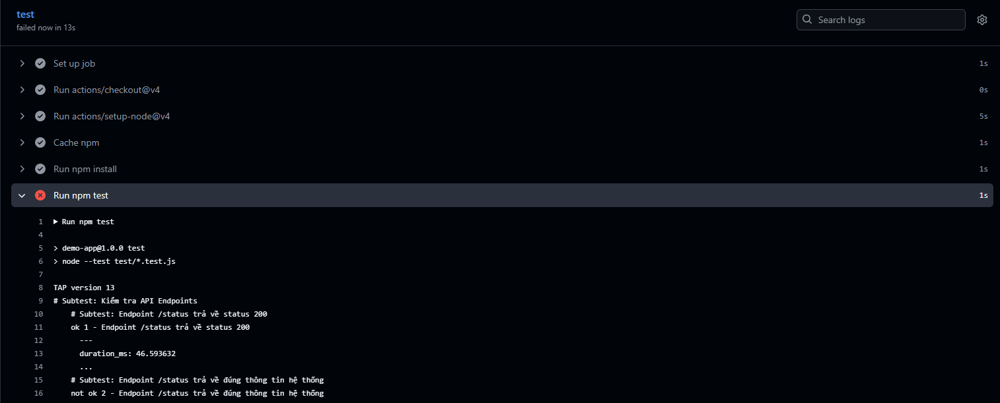
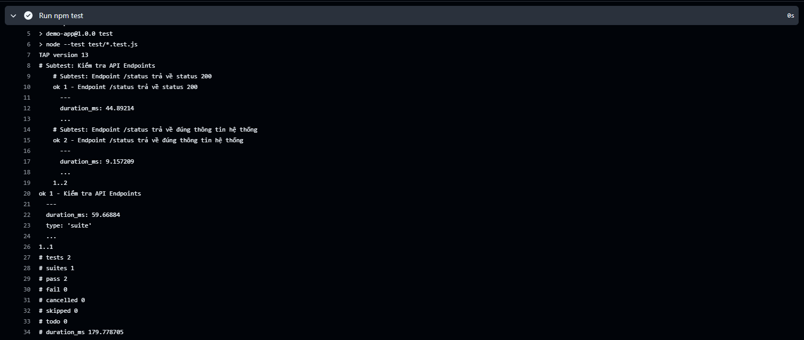
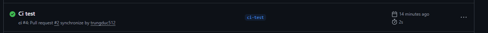
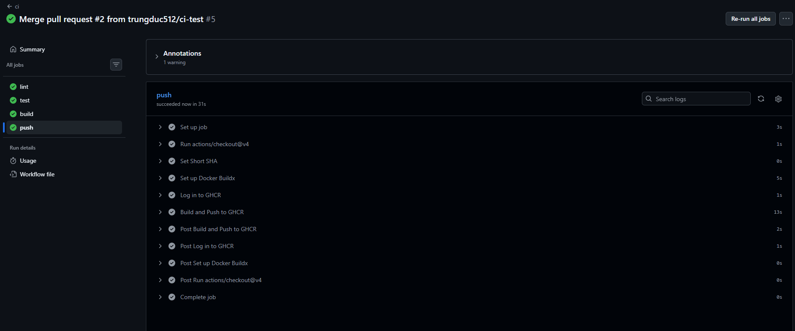
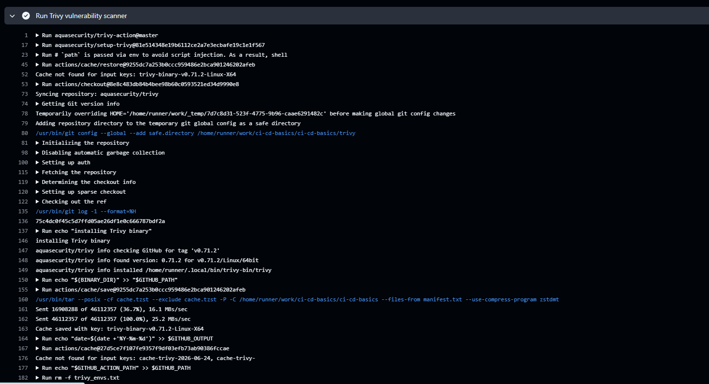
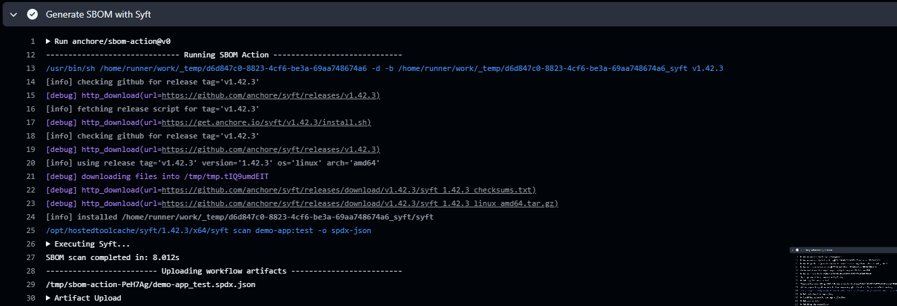

# Task: CI/CD Basics
Link github cicd repo: https://github.com/trungduc512/ci-cd-basics

- **Intern**: Đỗ Trung Đức
- **Phase/Week/Day**: phase-1/week-2/day-1-cicd-basics
- **Branch**: phase-1/week-2/day-1-cicd-basics
- **Submitted at**: 2026-06-24
- **Time spent**: 4h

# 1. Mục Tiêu

Hiểu được những khái niệm quan trọng trong CI/CD như: DORA 4 key metrics, Pipeline as Code, cách phân biệt các loại runner. Triển khai thành công một pipeline CI/CD hoàn chỉnh trên GitHub Actions bao gồm các công đoạn tự động: lint $\rightarrow$ test $\rightarrow$ build local $\rightarrow$ trivy scan CVE $\rightarrow$ push image lên GHCR.

---

# 2. Cách chạy và kết quả chi tiết

## Part A — Lý thuyết CI/CD, DORA Metrics & Runners

Tìm hiểu các câu hỏi lý thuyết quan trọng về phân biệt các khái niệm CI vs CD vs Continuous Deployment, ý nghĩa thực tế của 4 chỉ số DORA, điểm mạnh vượt trội của Pipeline as Code so với cấu hình UI, và bài toán tối ưu chi phí/bảo mật khi chọn Self-hosted Runner vs GitHub-hosted Runner.

- Xem chi tiết tại: [notes.md](notes.md)

## Part B — Demo một pipeline

Link github: https://github.com/trungduc512/ci-cd-basics

Repository đã được tái cấu trúc đồng nhất một nơi để quản lý. Ứng dụng đã được tách riêng mã nguồn vào thư mục `app/` và các kịch bản kiểm thử tích hợp vào thư mục `test/`. Pipeline được cấu hình tối ưu chạy tuần tự qua các stage: `lint` $\rightarrow$ `test` $\rightarrow$ `build-and-push` (Quét bảo mật độc lập trước khi đẩy lên registry).

### Kịch bản Lint/Test fail

Pipeline tự động trigger khi có Pull Request hướng về branch chính. Thử nghiệm kịch bản CI phát hiện lỗi sớm khi kiểm thử thất bại.

Endpoint `/status` trả về kết quả cấu hình thực tế, tuy nhiên trong assert mong đợi cố tình sửa thành `'DOWN'` để ép pipeline báo lỗi đỏ nghiệm thu luồng hoạt động.

Sau đó sửa để pipeline chạy được, qua bước test:

---

### Pipeline chạy thành công

Sử dụng kỹ thuật Docker Multi-stage tối ưu, can thiệp vào stage `runtime` để dọn sạch các binary thừa không an toàn. Kết quả pipeline đã chuyển màu xanh toàn bộ ở mọi phân đoạn:

### Package đã được build thành công

Docker Image ứng dụng đã được đóng gói gọn nhẹ, gán đầy đủ các OCI Labels, thiết lập cơ chế tự động theo dõi sức khỏe (`HEALTHCHECK`) qua `/status`, chạy an toàn dưới quyền non-root user và đẩy thành công lên GitHub Packages (GHCR):

---

## Part C — Bonus

Thêm step trivy scan image, fail nếu có CVE HIGH/CRITICAL.

Thêm step upload SBOM (syft).

# 3. Khó khăn và cách giải quyết

Khó khăn về Quản lý Đường dẫn và Context khi cấu trúc lại thư mục: Khi chuyển đổi toàn bộ dự án về quản lý tập trung trong một repository duy nhất và chia nhỏ thành các thư mục con (app/ chứa mã nguồn, test/ chứa file kiểm thử), hệ thống lập tức bị xung đột đường dẫn (Relative Path) ở 3 tầng khác nhau:

Khi chạy test: Lệnh require('../app/server.js') từ thư mục test/ bị sai đường dẫn nếu đứng từ thư mục gốc gọi lệnh.

Khi Docker build: Lệnh COPY app.js ./ cũ trong Dockerfile bị lỗi vì file app.js không còn nằm ở thư mục gốc nữa mà đã chuyển thành app/server.js.

Khi linter quét: ESLint không tìm thấy file cấu hình nếu không chỉ định rõ phạm vi kiểm tra cho từng folder con.

Cách giải quyết:

Về tầng Test: Sửa lại đường dẫn require trong file app.test.js thành vị trí tương đối chính xác đối với file test (../app/server.js). Đồng thời cập nhật package.json sử dụng đường dẫn glob pattern "test": "node --test test/*.test.js" để Node.js nhận diện đúng toàn bộ file test độc lập.

Về tầng Docker: Thay đổi chiến lược COPY trong Dockerfile. Thay vì copy file đơn lẻ, ta copy toàn bộ thư mục nguồn bằng lệnh COPY app/ ./app/ ở giai đoạn Builder, đồng thời cập nhật lại lệnh thực thi cuối cùng sang entrypoint mới: CMD ["node", "app/server.js"].

Về tầng Lint: Cập nhật lại script trong package.json thành "lint": "eslint app/ test/" để ép ESLint quét chính xác vào các thư mục con mong muốn mà không bị sót hoặc lỗi cú pháp.
---

# 4. Reference

- [GitHub Actions Documentation](https://docs.github.com/en/actions)
- [DORA Metrics - Google Cloud](https://cloud.google.com/devops/guides/dora-metrics)
- [Docker Buildx integration](https://github.com/docker/build-push-action)
- [Trivy Vulnerability Scanner Action](https://github.com/aquasecurity/trivy-action)
- Ứng dụng AI hỗ trợ tra cứu cấu trúc mô hình kiểm thử endpoint bằng module `node:test`.

---

# 5. Self-check

- [x] Pipeline xanh ít nhất 1 lần.
- [x] Image push thành công lên GHCR.
- [x] Có ít nhất 1 lần pipeline đỏ do test/lint fail (chứng minh CI hoạt động).
- [x] Cache hoạt động (job thứ 2 chạy nhanh hơn nhờ lưu cache npm).