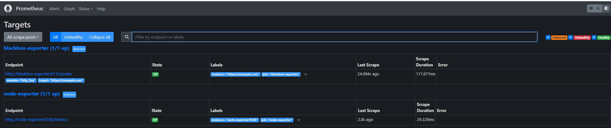
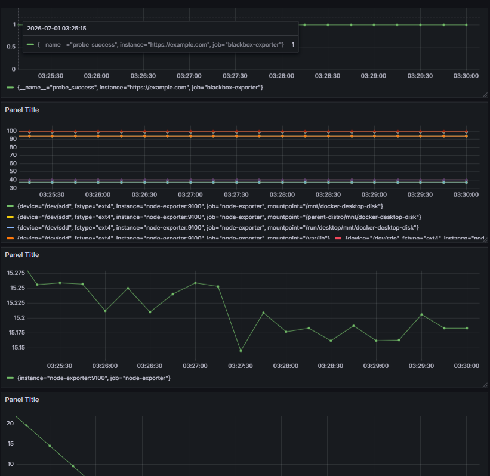

# Task: Day 10 — Observability Basics

- **Intern**: Đỗ Trung Đức
- **Phase/Week/Day**: phase-1/week-2/day-5-observability
- **Branch**: phase-1/week-2/day-5-observability
- **Submitted at**: 2026-07-01
- **Time spent**: 5h

## Mục tiêu

- Hiểu 3 trụ cột: **logs, metrics, traces**.
- Dựng được stack mini: Prometheus + Grafana + node-exporter.
- Biết khái niệm SLO / SLI / Error Budget.

## Cách chạy và kết quả chi tiết

### Part A — Notes

1. Phân biệt log vs metric vs trace (ví dụ cụ thể).
2. Pull-based (Prometheus) vs Push-based (StatsD, OpenTelemetry collector) — ưu nhược.
3. SLI / SLO / SLA khác nhau thế nào? Cho 1 ví dụ.
4. Cardinality nổ là gì, hậu quả?

Trả lời ở trong [notes.md](./notes.md)

### Part B — Stack docker-compose

Tạo `docker-compose.yml` chạy:

- `prom/prometheus:v2.55` — port 9090.
- `grafana/grafana:11.3.0` — port 3000.
- `prom/node-exporter:v1.8` — port 9100.
- `prom/blackbox-exporter:v0.25` — port 9115.

`prometheus.yml` scrape:

- `node-exporter:9100` mỗi 15s.
- `blackbox` probe `https://example.com` mỗi 30s

File [compose](./docker-compose.yml), chạy bằng `docker compose up -d`

### Part C — Grafana dashboard

Truy cập `localhost:3000`, tạo dashboard:

export ra file `json`

### Part D — Alert

Xem tại [alerts.md](alerts.md)

## Khó khăn

## Reference

- [prometheus tutorial](https://prometheus.io/docs/tutorials/getting_started/)

## Self check

- [x] Stack up bằng 1 lệnh.
- [x] Grafana hiển thị metric từ node-exporter.
- [x] Dashboard JSON import lại được trên máy mentor.