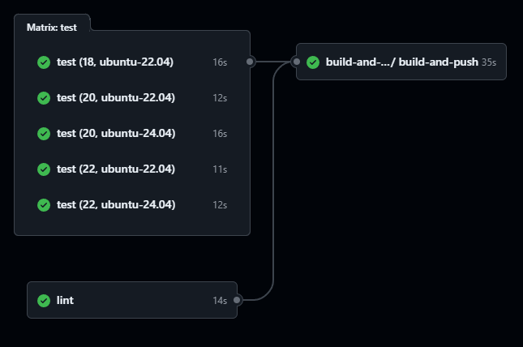
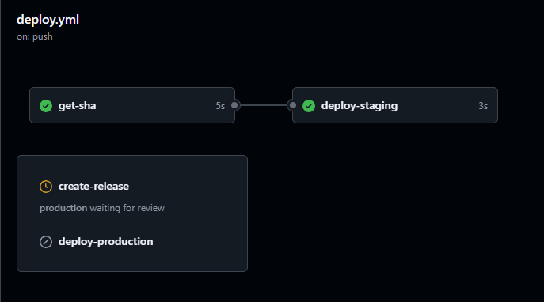
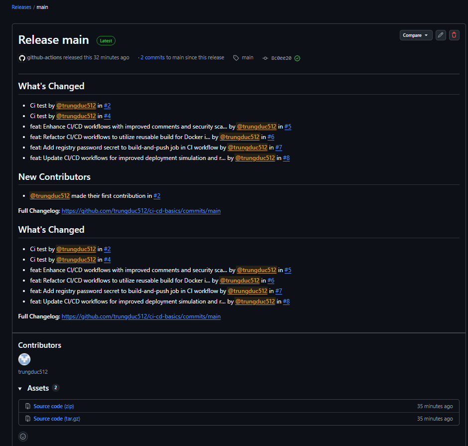

# Task: CI/CD Advanced

- **Intern**: Đỗ Trung Đức
- **Phase/Week/Day**: phase-1/week-2/day-2-cicd-advanced
- **Branch**: phase-1/week-2/day-2-cicd-advanced
- **Submitted at**: 2026-06-26
- **Time spent**: 6h

# 1. Mục Tiêu

Biết cách chạy job với strategy matrix, viết workflow để reusable, biết cách chia environment staging + production, biết cách deploy và release 1 phiên bản và sử dụng tag. Hiểu được một số scenarios nâng cao trong triển khai CI/CD pipeline.

# 2. Cách chạy và kết quả chi tiết

Link repo demo: https://github.com/trungduc512/ci-cd-basics

## Part A — Matrix

Thực hiện chạy job `test` với strategy `matrix`, dưới đây là kết quả:

## Part B — Reusable workflow

Tách job build_and_push ra workflow riêng `.github/workflows/reusable-build.yml` để reuse, workflow này nhận input là `image_name` + `image_tag`, workflow `ci` cũ gọi qua `uses: ./.github/workflows/reusable-build.yml`

## Part C — Environment + approval

Tạo 2 environment trên GitHub: `staging`, `production`.

- `production` bật **required reviewer**
- Workflow `deploy.yml` có 2 job:
  - `deploy-staging` chạy ngay khi merge vào `main`.
  - `deploy-production` chạy khi tag `v*.*.*`, **chờ approval**.

### Kết quả:

## Part D — Tag-based release

Viết một workflow `release.yml` để tự động release khi có tag mới, workflow này sẽ:

- tạo github release

### Kết quả:

Pipeline chạy thành công:

## Part E — Failure scenarios

Xem chi tiết trong [notes.md](notes.md)

# 3. Khó khăn

# 4. Reference

- [Reuse workflow](https://docs.github.com/en/actions/how-tos/reuse-automations/reuse-workflows)
- [Workflow variation](https://docs.github.com/en/actions/how-tos/write-workflows/choose-what-workflows-do/run-job-variations)
- [Retag image using docker buildX](https://docs.docker.com/reference/cli/docker/buildx/imagetools/create/)
- Em sử dụng AI để tra cứu nhanh những thuật ngữ và syntax chưa biết.

---

# 5. Self-check

- [x] Matrix chạy 5 combo (sau exclude 1).
- [x] Reusable workflow được gọi.
- [x] `production` deploy job bị block chờ approval, sau approve thì chạy.
- [x] Release tag tạo ra GitHub Release tự động.