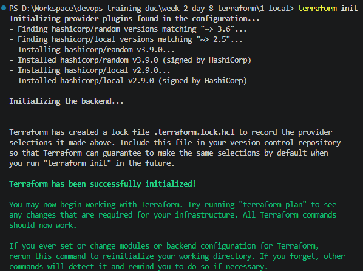
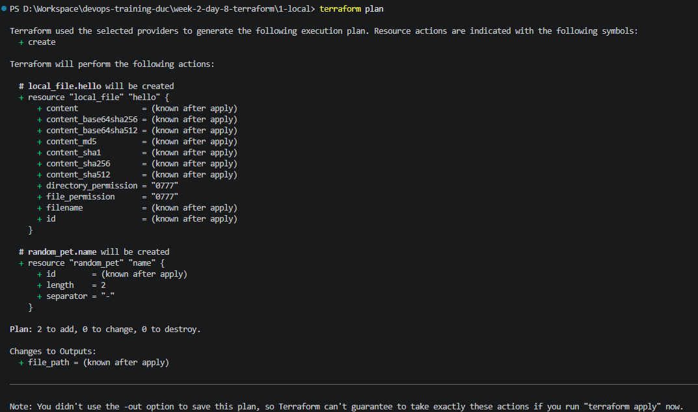
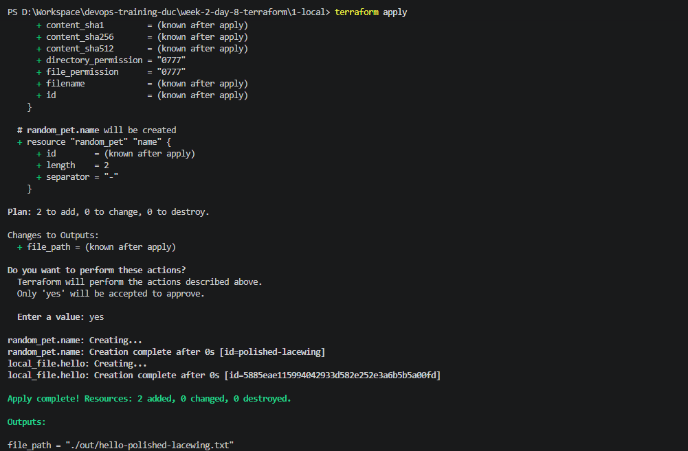
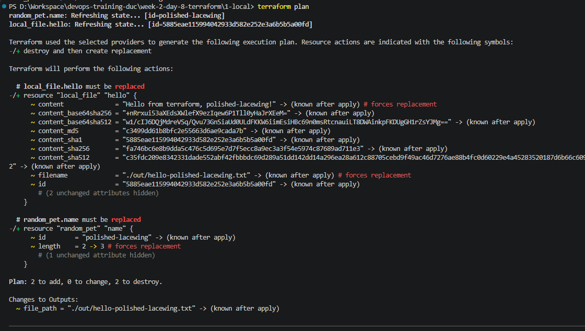
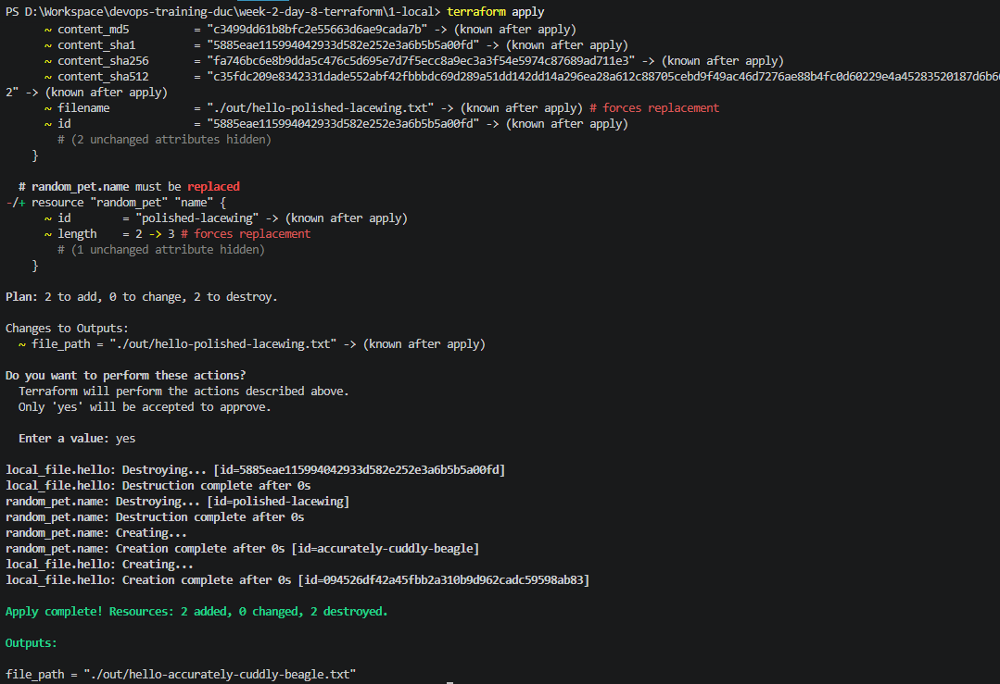
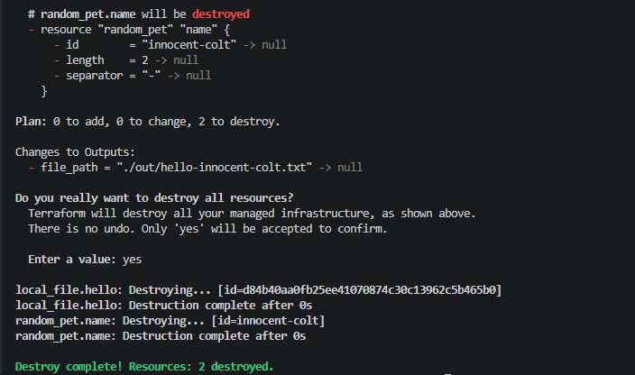
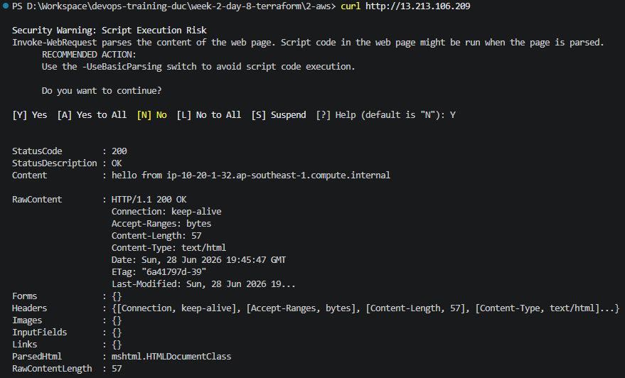
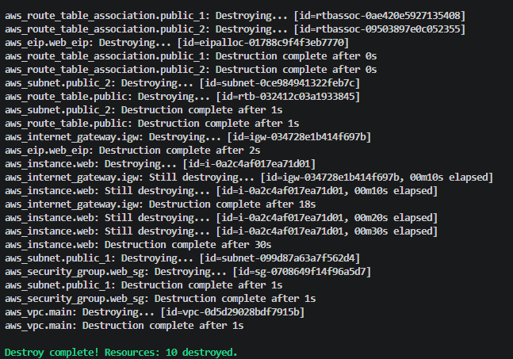
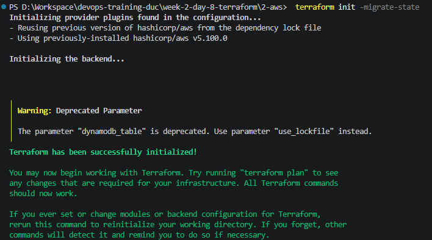

# Task: Terraform Basics

- **Intern**: Đỗ Trung Đức
- **Phase/Week/Day**: phase-1/week-2/day-3-terraform
- **Branch**: phase-1/week-2/day-3-terraform
- **Submitted at**: 2026-06-29
- **Time spent**: 4h

# 1. Mục Tiêu

- Hiểu mô hình IaC declarative.
- Nắm vững: provider, resource, variable, output, state, data source.
- Provision được hạ tầng cơ bản trên AWS.

# 2. Cách chạy và kết quả chi tiết

## Part A — Lý thuyết

Xem chi tiết trong [notes.md](notes.md)

## Part B — Mini lab 1: Local-only

Terraform init && plan && apply.

Terraform init



Terraform plan



Terraform apply




Sửa length = 3 → plan thấy gì?



Apply.



terraform destroy.
Capture transcript vào 1-local-transcript.log.

### Kết quả

Log được chụp




## Part C — Mini lab 2: AWS VPC + EC2

Chi tiết triển khai ở trong [này](./2-aws/README.md)

### Kết quả






### Part D — Remote backend

Sau khi tạo bucket `tfstate-duy-f9c7c965` và DynamoDB table `tfstate-lock` và thêm file `2-aws\backend.tf` với config:

```hcl
terraform {
  backend "s3" {
    bucket         = "tfstate-duy-f9c7c965"
    key            = "phase1/week2/day3.tfstate"
    region         = "ap-southeast-1"
    dynamodb_table = "tfstate-lock"
    encrypt        = true
  }
}
```

### Kết quả




# 3. Khó khăn

# 4. Reference

- [terraform language doc](https://developer.hashicorp.com/terraform/language)
- [aws provider doc](https://registry.terraform.io/providers/hashicorp/aws/latest/docs)
- [small size terraform best practice](https://github.com/antonbabenko/terraform-best-practices/tree/master/examples/small-terraform)

---

# 5. Self-check

- [x] Lab 1 chạy plan/apply/destroy đúng.
- [x] Lab 2: curl được nginx qua public IP.
- [x] Đã `terraform destroy` sạch.
- [x] Không commit `*.tfstate` / `*.tfvars` thật.