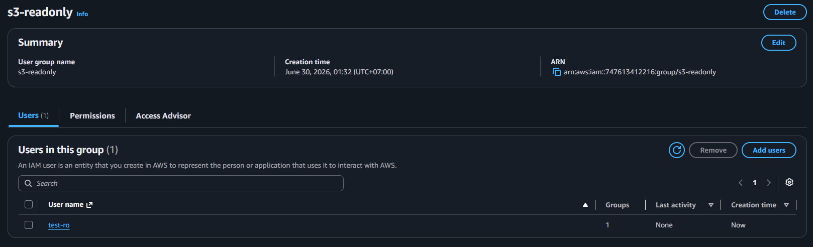
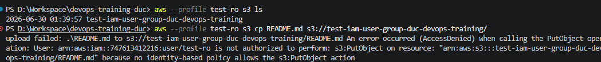
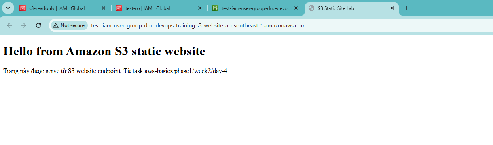
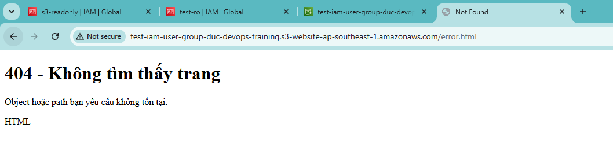
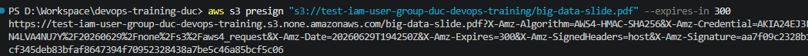

# Task: Aws Basics

- **Intern**: Đỗ Trung Đức
- **Phase/Week/Day**: phase-1/week-2/day-4-aws-basics
- **Branch**: phase-1/week-2/day-4-aws-basics
- **Submitted at**: 2026-06-30
- **Time spent**: 4h

# Mục Tiêu

Hiểu IAM (user, group, role, policy, trust policy). Hiểu hơn về S3: bucket policy, static site, presigned URL. Nắm sơ đồ VPC, subnet public/private, NAT, IGW. Biết khái niệm: region, AZ, edge location.

# Cách chạy và triển khai

## Part A — IAM

Trả lời các câu hỏi trong [notes.md](./notes.md)

## Part B — Lab IAM

Sau khi config trên IAM console, được kết quả như sau:



Test access:



## Part C — S3 static site

### Kết quả:





## Part D — Presigned URL

### Generate presigned URL TTL 5 phút bằng AWS CLI

Chạy lệnh:

```bash
aws s3 presign "s3://$BUCKET/test_presign.txt" --expires-in 300
```




### Script Python `presign.py` dùng `boto3`

Chạy script:

```bash
python3 presign.py \
  --bucket "ten-bucket" \
  --key tenfile \
  --expires-in 300
```

## Part E — VPC topology

Trả lời các câu hỏi trong [notes.md](./notes.md)

# Reference

- [iam best practices](https://docs.aws.amazon.com/IAM/latest/UserGuide/best-practices.html)
- [s3 static site hosting](https://docs.aws.amazon.com/AmazonS3/latest/userguide/WebsiteHosting.html)
- [vpc](https://docs.aws.amazon.com/vpc/latest/userguide/what-is-amazon-vpc.html)

# Self check

- [x] IAM user `test-ro` bị Deny đúng theo policy.
- [x] Static site truy cập được public.
- [x] Presigned URL hoạt động & expire đúng.
- [x] Sau dọn dẹp không còn resource paid.