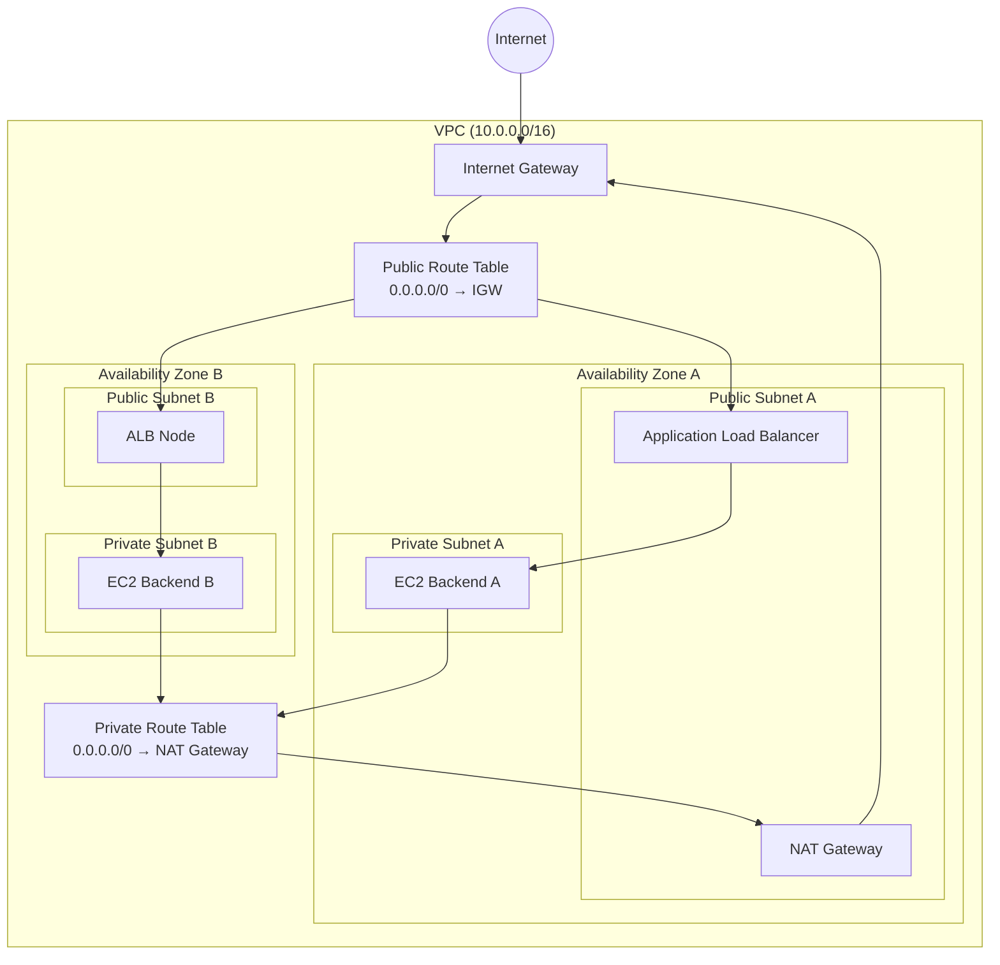

# Part A — AWS IAM Essentials

---

# 1. Phân biệt User, Group, Role và Policy

## IAM User

IAM User là một **định danh (Identity)** đại diện cho một người dùng hoặc một ứng dụng cần tương tác với AWS.

User có thể sở hữu **thông tin xác thực dài hạn (Long-lived Credentials)** như:

* Password (đăng nhập AWS Management Console)
* Access Key ID
* Secret Access Key (AWS CLI/SDK)

Ví dụ:

* `minh`
* `backend-service`

---

## IAM Group

IAM Group là **một tập hợp các IAM User**.

Group **không phải là một Identity**, không thể đăng nhập AWS và cũng không thể tạo Access Key. Mục đích của Group là **quản lý quyền cho nhiều User cùng lúc**.

Ví dụ:

* `developers`
* `devops-engineers`
* `auditors`

Thay vì gán Policy cho từng User, chỉ cần gán Policy cho Group rồi thêm User vào Group.

---

## IAM Role

IAM Role cũng là một **Identity**, nhưng **không có thông tin xác thực cố định**.

Role được thiết kế để các thực thể khác **Assume Role**, ví dụ:

* EC2
* Lambda
* ECS Task
* GitHub Actions (OIDC)
* IAM User
* AWS Account khác

Khi Assume Role, AWS Security Token Service (STS) sẽ cấp **Temporary Credentials** gồm:

* Access Key ID
* Secret Access Key
* Session Token

Credential này chỉ có hiệu lực trong một khoảng thời gian nhất định rồi tự hết hạn.

---

## IAM Policy

IAM Policy là một tài liệu JSON mô tả quyền truy cập.

Policy quy định:

* Được phép hay bị cấm (`Effect`)
* Thực hiện hành động gì (`Action`)
* Trên tài nguyên nào (`Resource`)
* Với điều kiện gì (`Condition`)

Policy **không tự có hiệu lực**, mà phải được gắn (Attach) vào:

* User
* Group
* Role
* Một số Resource (Bucket Policy, KMS Key Policy...)

---

# 2. Identity Policy vs Resource Policy vs Trust Policy

| Tiêu chí  | Identity Policy                    | Resource Policy                         | Trust Policy                 |
| --------- | ---------------------------------- | --------------------------------------- | ---------------------------- |
| Gắn vào   | User, Group hoặc Role              | Resource (S3 Bucket, SQS, KMS...)       | IAM Role                     |
| Mục đích  | Quy định Identity được phép làm gì | Quy định ai được phép truy cập Resource | Quy định ai được Assume Role |
| Principal | Không cần                          | Bắt buộc                                | Bắt buộc                     |
| Ví dụ     | Cho phép EC2 đọc S3                | Bucket Policy cho phép public download  | EC2 được Assume Role         |

### Identity Policy

Định nghĩa **Identity được phép làm gì**.

Ví dụ:

* `s3:GetObject`
* `ec2:StartInstances`

---

### Resource Policy

Định nghĩa **những ai được phép truy cập Resource**.

Ví dụ:

* S3 Bucket Policy
* KMS Key Policy
* SQS Queue Policy

Ví dụ Bucket Policy:

```json
{
  "Principal": "*",
  "Action": "s3:GetObject"
}
```

---

### Trust Policy

Chỉ tồn tại trên **IAM Role**.

Trust Policy định nghĩa **Principal nào được phép Assume Role**.

Ví dụ:

```json
{
  "Principal": {
    "Service": "ec2.amazonaws.com"
  }
}
```

Nghĩa là:

> EC2 Service được phép Assume Role này.

---

# 3. Tại sao IAM Role tốt hơn IAM User Key cho EC2 và CI/CD?

## Không lưu Access Key lâu dài

Nếu sử dụng IAM User Key, Access Key phải được lưu trên:

* EC2
* GitHub Secrets
* Jenkins
* File cấu hình

Nếu bị lộ, attacker có thể sử dụng cho đến khi key bị thu hồi.

IAM Role sử dụng **Temporary Credentials** do STS sinh ra nên không cần lưu secret lâu dài.

---

## Tự động Rotate Credential

Đối với EC2, AWS tự động cấp và làm mới Credential thông qua:

* Instance Profile
* Instance Metadata Service (IMDS)

Developer không cần tự viết script để rotate Access Key.

---

## Bảo mật hơn

Credential của IAM Role:

* Có thời hạn ngắn
* Tự hết hạn
* Có thể giới hạn Session
* Tuân thủ nguyên tắc Least Privilege

Ngay cả khi bị lộ, Credential cũng nhanh chóng mất hiệu lực.

---

# 4. Giải thích Policy JSON

```json
{
  "Version": "2012-10-17",
  "Statement": [{
    "Effect": "Allow",
    "Action": ["s3:GetObject"],
    "Resource": "arn:aws:s3:::my-bucket/*",
    "Condition": {
      "IpAddress": {
        "aws:SourceIp": "203.0.113.0/24"
      }
    }
  }]
}
```

### Version

Phiên bản ngôn ngữ của IAM Policy.

Giá trị hiện tại là:

```
2012-10-17
```

---

### Statement

Danh sách các Rule trong Policy.

Một Policy có thể chứa nhiều Statement.

---

### Effect

Quy định hành động:

* `Allow`
* `Deny`

---

### Action

```text
s3:GetObject
```

Chỉ cho phép tải Object từ S3.

Không bao gồm:

* PutObject
* DeleteObject
* ListBucket

---

### Resource

```text
arn:aws:s3:::my-bucket/*
```

Áp dụng cho **tất cả Object** bên trong Bucket `my-bucket`.

---

### Condition

```json
"IpAddress": {
    "aws:SourceIp": "203.0.113.0/24"
}
```

Policy chỉ có hiệu lực nếu request đến từ dải IP:

```
203.0.113.0/24
```

Nếu truy cập từ IP khác, quyền sẽ không được cấp.

---

# 5. Group Allow nhưng User Deny thì sao?

Kết quả cuối cùng:

> **Access Denied**

AWS đánh giá Policy theo thứ tự:

1. Mặc định tất cả Request đều bị từ chối (Implicit Deny).
2. Nếu tìm thấy Explicit Allow thì quyền được cấp.
3. Nếu xuất hiện bất kỳ Explicit Deny nào thì Deny sẽ **ghi đè toàn bộ Allow**.

Ví dụ:

* Group:

```
Allow s3:GetObject
```

* User:

```
Deny s3:GetObject
```

Kết quả:

```
DENY
```

Vì **Explicit Deny luôn có độ ưu tiên cao nhất**.

---

# Part E — AWS VPC Topology

## Mermaid Diagram



---

# 1. Tại sao Backend phải nằm trong Private Subnet?

Đây là Best Practice khi thiết kế hạ tầng AWS.

## Không có Public IP

EC2 Backend không được gán Public IP nên không thể bị truy cập trực tiếp từ Internet.

---

## Giảm Attack Surface

Internet chỉ có thể truy cập tới Application Load Balancer (ALB).

ALB sẽ:

* nhận HTTP/HTTPS request
* kiểm tra Health Check
* cân bằng tải
* forward request xuống Backend

Backend hoàn toàn không mở ra Internet.

---

## Security Group đơn giản hơn

Security Group của Backend chỉ cần cho phép:

```
Source:
Security Group của ALB
```

Không cần mở:

```
0.0.0.0/0
```

Điều này giúp tăng tính bảo mật.

---

# 2. Outbound Internet đi qua đâu?

Khi Backend cần:

* cập nhật hệ điều hành
* tải package
* gọi Third-party API

Traffic sẽ đi theo đường:

```
EC2 Backend
        │
        ▼
Private Route Table
        │
        ▼
NAT Gateway
(Public Subnet)
        │
        ▼
Internet Gateway
        │
        ▼
Internet
```

Quá trình hoạt động:

1. EC2 gửi request ra ngoài (`0.0.0.0/0`).
2. Private Route Table chuyển traffic tới NAT Gateway.
3. NAT Gateway thực hiện Source NAT (SNAT), thay Private IP bằng Elastic IP.
4. Traffic đi qua Internet Gateway để ra Internet.
5. Response quay trở lại NAT Gateway rồi được chuyển về đúng EC2.

Nhờ đó:

* EC2 **có thể chủ động kết nối ra Internet**.
* Internet **không thể chủ động kết nối trực tiếp vào EC2**.
